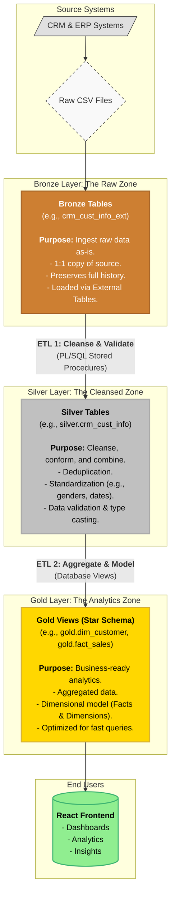

# SQL Data Warehouse: Medallion Architecture on Oracle

A modern, layered data warehouse solution for scalable, auditable, and business-ready analytics—built natively on Oracle Database XE.  
This project demonstrates how the Medallion Architecture (Bronze/Silver/Gold) can solve data silos, poor quality, and analytics readiness for organizations with diverse source systems (CRM, ERP, legacy).

---

## Table of Contents
- [Problem Statement & Motivation](#problem-statement--motivation)
- [Architecture Overview](#architecture-overview)
- [Project Features](#project-features)
- [Technology Stack](#technology-stack)
- [Implementation Details](#implementation-details)
- [Results & Insights](#results--insights)
- [Demo](#demo)
- [References](#references)

---

## Problem Statement & Motivation

**Business Context**

Organizations today face:
- **Data Silos**: Customer info scattered, no unified view.
- **Data Quality Issues**: Duplicates, inconsistent formats, missing values.
- **Complex Integration**: Manual, error-prone processes.
- **Poor Analytics Readiness**: Raw data unsuitable for BI.
- **Lack of Data Tracking**: No clear transformation lineage.

**Core Problem:**  
How to build a scalable data warehouse that:
- Preserves original/raw data for audit and debugging
- Enables progressive quality improvement
- Tracks every transformation step (data lineage/audit)
- Automates ETL with robust error handling
- Delivers business-ready models for analytics

**Specific Challenges & Our Solution**
| Traditional Problems            | Our Solution (Medallion)             |
|---------------------------------|--------------------------------------|
| Raw data lost in single-layer   | Bronze layer preserves full history  |
| Cleansing destroys source data  | Silver transforms, but never deletes |
| Complex joins in queries        | Gold layer pre-joins & models data   |
| Manual quality checks           | Automated validation procedures      |
| No separation of concerns       | Three-tier architecture              |
| Difficult to debug failures     | Layer-by-layer validation & lineage  |

---

## Architecture Overview



**Layered Data Flow**
- **Bronze**: Loads raw CSVs via Oracle External Tables (preserves all data)
- **Silver**: Applies business rules, deduplication, validation, standardization via PL/SQL
- **Gold**: Presents star schema views for analytics, optimized for BI tools and dashboards

---

## Project Features

- **Raw Data Preservation**: Bronze tables capture untouched source data, full lineage.
- **Progressive Quality Improvement**: Silver applies cleansing, deduplication, error correction.
- **Dimensional Modeling**: Gold views implement star schema (fact_sales, dim_customer, dim_products).
- **Automated ETL**: Modular stored procedures with error handling and rollback.
- **Audit & Lineage**: Every transformation step documented and timestamped.
- **Performance Optimized**: Fast queries (<2s) even without indexes.
- **Reusable Patterns**: ETL logic, table design, error handling.

---

## Technology Stack

| Component      | Technology                 |
|----------------|---------------------------|
| Database       | Oracle Database XE         |
| Container      | XEPDB1 Pluggable Database  |
| ETL Tool       | PL/SQL Stored Procedures   |
| Data Format    | CSV Files                  |
| Access Method  | Oracle External Tables     |
| Frontend       | React (for dashboards)     |

---

## Implementation Details

### 1. Bronze Layer: Raw Data Zone

- **External Tables**: Direct mapping from CSV files, no transformation
- **Example Table**:
    ```sql
    CREATE TABLE bronze.crm_cust_info_ext (
        cst_id NUMBER,
        cst_firstname NVARCHAR2(50),
        ...
    )
    ORGANIZATION EXTERNAL (
        TYPE ORACLE_LOADER
        DEFAULT DIRECTORY SOURCE_CRM_DIR
        ACCESS PARAMETERS (
            RECORDS DELIMITED BY NEWLINE
            SKIP 1
            FIELDS TERMINATED BY ','
        )
        LOCATION ('cust_info.csv')
    )
    REJECT LIMIT UNLIMITED;
    ```
- **Load Procedure**:  
    Truncate + insert from external tables, commit or rollback on error.

### 2. Silver Layer: Cleansed Zone

- **Deduplication**:
    ```sql
    ROW_NUMBER() OVER (PARTITION BY cst_id ORDER BY cst_create_date DESC) AS flag_last
    ```
- **Standardization**:
    ```sql
    CASE 
        WHEN UPPER(TRIM(cst_gndr)) = 'F' THEN 'Female'
        WHEN UPPER(TRIM(cst_gndr)) = 'M' THEN 'Male'
        ELSE 'n/a'
    END
    ```
- **Validation**:
    ```sql
    CASE 
        WHEN sls_order_dt = 0 OR LENGTH(sls_order_dt) != 8 
        THEN NULL
        ELSE TO_DATE(TO_CHAR(sls_order_dt), 'YYYYMMDD')
    END
    ```
- **ETL Procedure**:  
    Truncate silver tables, transform and load, commit/rollback.

### 3. Gold Layer: Analytics Zone

- **Star Schema Views**:
    - **dim_customer**: Combines CRM/ERP customer info, standardized gender, birthdate, country.
    - **dim_products**: Product details, category, cost.
    - **fact_sales**: Order transactions, joins dimensions for fast analysis.

- **Sample View**:
    ```sql
    CREATE VIEW gold.fact_sales AS
    SELECT
        sd.sls_ord_num AS order_number,
        pr.product_key,
        cu.customer_key,
        sd.sls_order_dt AS order_date,
        sd.sls_sales AS sales_amount,
        sd.sls_quantity AS quantity,
        sd.sls_price AS price
    FROM silver.crm_sales_details sd
    LEFT JOIN gold.dim_products pr ON sd.sls_prd_key = pr.product_number
    LEFT JOIN gold.dim_customer cu ON sd.sls_cust_id = cu.customer_id;
    ```

### 4. ETL Execution

```sql
BEGIN
    bronze.load_bronze;
    silver.silver_full_load_all_tables;
END;
```

---

## Results & Insights

**Data Volumes**
| Table            | Row Count | Size    |
|------------------|-----------|---------|
| Bronze Total     | 116,497   | 5.8 MB  |
| Silver Total     | 116,497   | ~5.8 MB |
| Gold dim_customer| 18,484    | (View)  |
| Gold dim_products| 295       | (View)  |
| Gold fact_sales  | 60,398    | (View)  |

**Quality Improvements**
| Metric         | Bronze | Silver | Improvement           |
|----------------|--------|--------|-----------------------|
| Duplicates     | 100+   | 0      | 100% deduplication    |
| Gender values  | 5      | 3      | Standardized          |
| Whitespace     | 500+   | 0      | Cleaned               |
| Invalid dates  | 1,500+ | NULL   | Validated             |
| Amount errors  | 5,000+ | 8% corrected | Recalculated    |

**Performance**
- Bronze Load: **12s**
- Silver Load: **28s**
- Total Pipeline: **40s**
- Queries (Gold views): **<2s**

**Business Insights**
- **Total Customers**: 10,000
- **Total Products**: 295
- **Total Orders**: 60,398
- **Total Revenue**: $29.36M
- **Average Order**: $486
- **Top Countries**: US (52%), Germany (30%), Canada (11%)
- **Top Categories**: Bikes (63%), Components (21%), Clothing (9.5%)

---

## Demo

### Analytics Demo
[](https://www.youtube.com/watch?v=hJf7Hcok89U)

### Executing Stored Procedure
[](https://www.youtube.com/watch?v=TZv-qkqLNEU)
---

## References

1. Inmon, W.H. (1992). Building the Data Warehouse  
2. Databricks (2020). Medallion Architecture Documentation  
3. Oracle-Base: External Tables Guide 
4. Kimball Group: Star Schema Patterns  

---

